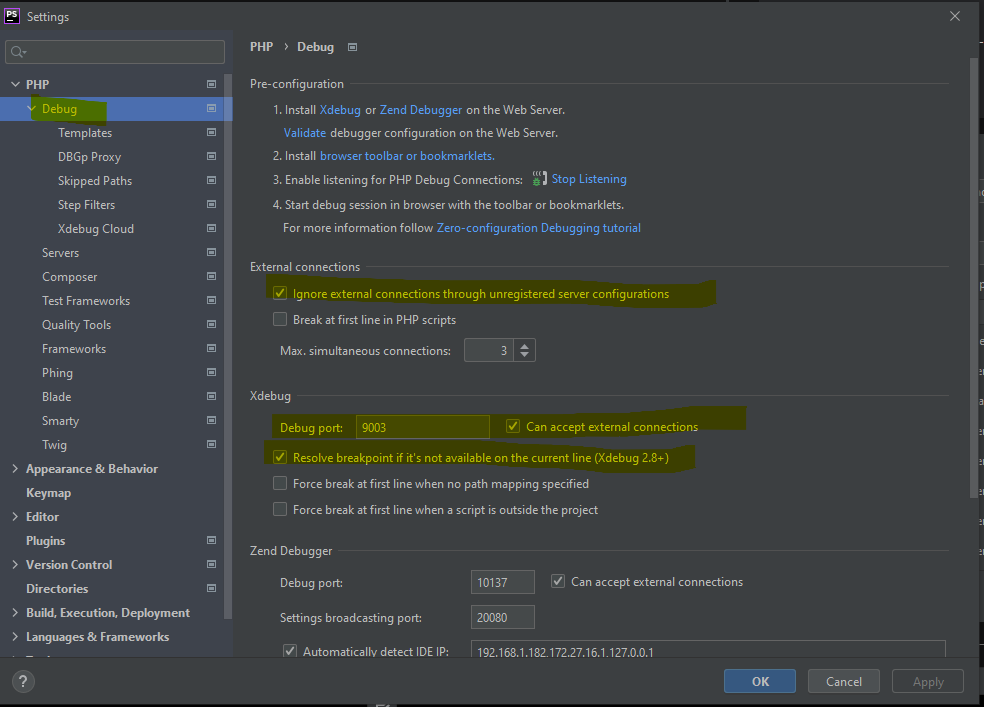
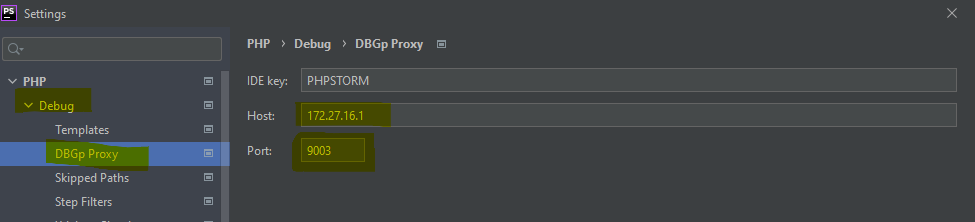

#Check whether your debugging client is listening on the indicated address. 
    - run docker-compose up
    - On Linux and OSX, you can use netstat -a -n | grep LISTEN to check. Windows ipconfig

    - Copy local.env.exmample to local.env and change client_host ip to founded in net stat

    - configure in phpStorm server - 
        name localhost
        host = your container ip/
        map file directory to your
    - run docker-compose up -d

    - configure Debug in settings

---

    
    - Setup xdebug in chrome browser

    
    - enable debug
